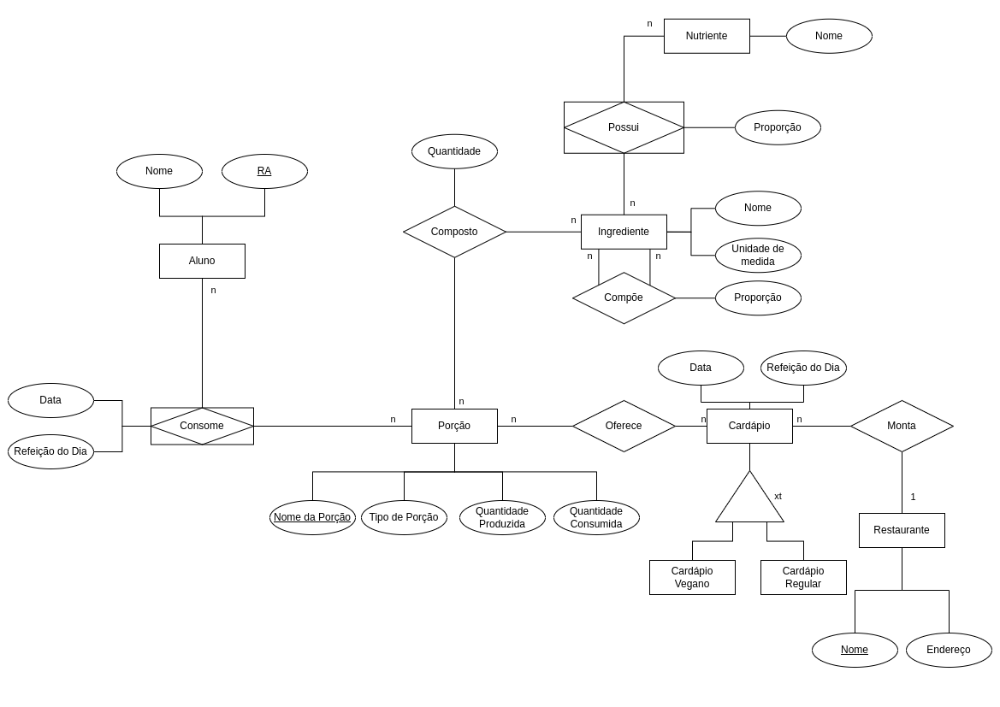

# Equipe `LAMEV`

# Subgrupo `A`
* `Artur De Miranda Rodrigues` - `224538`
* `Eliel Oliveira da Silva` - `221437`
* `Matheus Farias Barbosa` - `230888`

## Modelo Conceitual ER Revisado

*Diagrama ER Revisado*

## Mapeamento para o Modelo Relacional
~~~
Aluno(__RA__, Nome)  
Restaurante(__NomeRestaurante__, endereço)  
Porção(__NomePorção__, TipoPorção, QuantidadeProduzida, QuantidadeConsumida)  
Cardápio(__CardápioID__, Restaurante, Data, Refeição, TipoCardapio)
  Restaurante chave estrangeira -> Restaurante(NomeRestaurante)

CardapioOferece(__Porção__, __Cardapio__)
  Porção chave estrangeira -> Porção(NomePorção)
  Cardápio chave estrangeira -> Cardápio(CardápioID)

Ingrediente(__NomeIngrediente__, unidade_de_referencia)

IngredientePorção(__ID__, Porção, Ingrediente, Quantidade)  
  Porção chave estrangeira -> Porção(NomePorção)
  Ingrediente chave estrangeira -> Ingrediente(NomeIngrediente)  

ComposiçãoIngrediente(__ID__, IngredientePrincipal, IngredienteSegundário, Proporção)  
  IngredientePrincipal chave estrangeira -> Ingrediente(NomeIngrediente)  
  IngredienteSecundário chave estrangeira -> Ingrediente(NomeIngrediente)

Nutriente(__NomeNutriente__) 
NutrienteIngrediente(__ID__, Nutriente, Ingrediente, Proporção)  
  IngredientePrincipal chave estrangeira -> Ingrediente(NomeIngrediente)  
  IngredienteSecundario chave estrangeira -> Ingrediente(NomeIngrediente)

Consumo(__ID__, Aluno, Porção, data, Refeição)
  Aluno chave estrangeira -> Aluno(RA)
  Porção chave estrangeira -> Porção(NomePorção)
~~~
