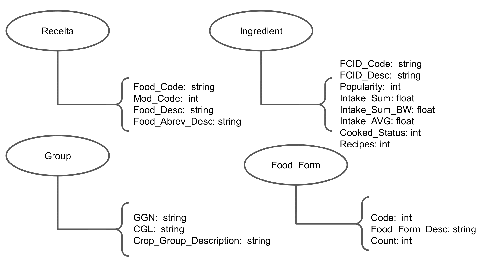
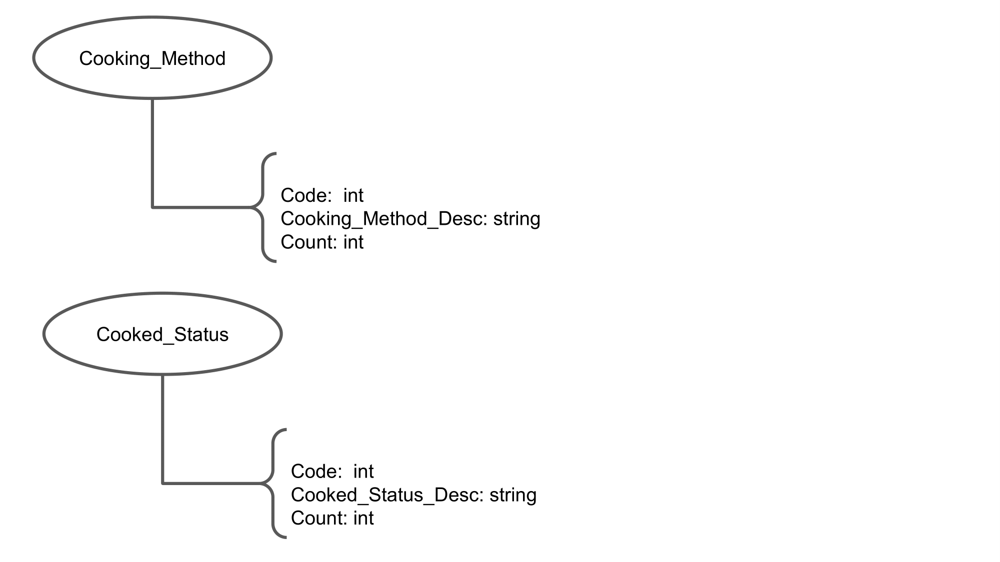
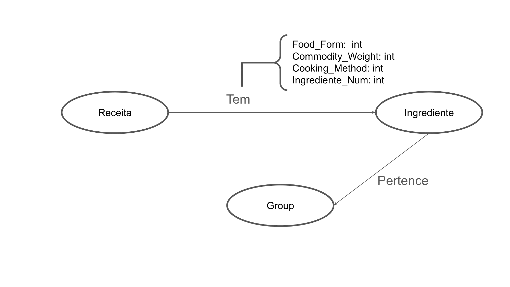

# Equipe `LAMEV`

# Subgrupo `A`
* `Artur De Miranda Rodrigues` - `224538`
* `Eliel Oliveira da Silva` - `221437`

## Modelo Lógico do Banco de Dados de Grafos

## Perguntas de Pesquisa/Análise

> * Existem receitas que possuem o mesmo ingrediente mais de uma vez, porém em Cooking_method || Food_form diferentes?

> * Existem receitas diferentes que possuem exatamente os mesmos ingredientes, sejam em cooking_methods || Food_Form diferentes ou não.

> * Existem receitas que são feitas usando ingredientes de apenas um grupo alimentar?

> * Quais são as receitas que possuem ingredientes com grupos mais variados?

> * Qual a quantidade média de alimentos por receita?
